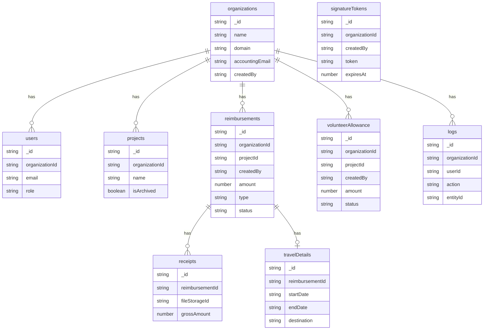

# Database schema

MongoDB stores the following application collections. Every business entity is
scoped through its `organizationId` or through a parent entity carrying that
scope.

The authoritative field definitions live in
[`app/lib/db/types.ts`](../app/lib/db/types.ts), while indexes are defined in
[`app/lib/db/indexes.ts`](../app/lib/db/indexes.ts).
