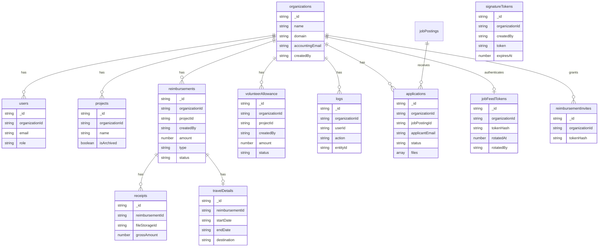

# Database schema

MongoDB stores the following application collections. Every business entity is
scoped through its `organizationId` or through a parent entity carrying that
scope.

Application files are embedded in the application snapshot so the application
and its initial per-file import status are stored atomically. Source URLs remain
server-only. Imported objects use deterministic storage keys; each file records
its status, attempt count, error and final object key.

The authoritative field definitions live in
[`app/lib/db/types.ts`](../app/lib/db/types.ts), while indexes are defined in
[`app/lib/db/indexes.ts`](../app/lib/db/indexes.ts).
