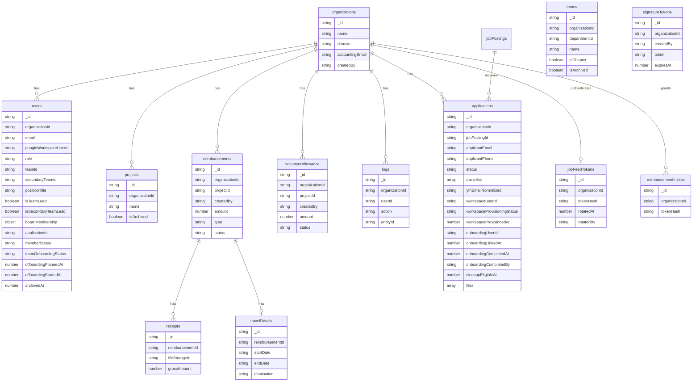

# Database schema

MongoDB stores the following application collections. Every business entity is
scoped through its `organizationId` or through a parent entity carrying that
scope.

```mermaid
erDiagram
    organizations ||--o{ users : has
    organizations ||--o{ projects : has
    organizations ||--o{ reimbursements : has
    organizations ||--o{ volunteerAllowance : has
    organizations ||--o{ logs : has
    organizations ||--o{ applications : has
    jobPostings ||--o{ applications : receives
    organizations ||--o| jobFeedTokens : authenticates
    organizations ||--o{ reimbursementInvites : grants
    reimbursements ||--o{ receipts : has
    reimbursements ||--o| travelDetails : has

    organizations {
        string _id
        string name
        string domain
        string accountingEmail
        string createdBy
    }

    jobFeedTokens {
        string _id
        string organizationId
        string tokenHash
        number rotatedAt
        string rotatedBy
    }

    reimbursementInvites {
        string _id
        string organizationId
        string tokenHash
    }

    users {
        string _id
        string organizationId
        string email
        string googleWorkspaceUserId
        string role
        string teamId
        string secondaryTeamId
        string positionTitle
        boolean isTeamLead
        boolean isSecondaryTeamLead
        object boardMembership
        string applicationId
        string memberStatus
        string teamOnboardingStatus
        number offboardingPlannedAt
        number offboardingStartedAt
        number archivedAt
    }

    teams {
        string _id
        string organizationId
        string departmentId
        string name
        boolean isChapter
        boolean isArchived
    }

    projects {
        string _id
        string organizationId
        string name
        boolean isArchived
    }

    reimbursements {
        string _id
        string organizationId
        string projectId
        string createdBy
        number amount
        string type
        string status
    }

    receipts {
        string _id
        string reimbursementId
        string fileStorageId
        number grossAmount
    }

    travelDetails {
        string _id
        string reimbursementId
        string startDate
        string endDate
        string destination
    }

    volunteerAllowance {
        string _id
        string organizationId
        string projectId
        string createdBy
        number amount
        string status
    }

    signatureTokens {
        string _id
        string organizationId
        string createdBy
        string token
        number expiresAt
    }

    applications {
        string _id
        string organizationId
        string jobPostingId
        string applicantEmail
        string applicantPhone
        string status
        array ownerIds
        string yfnEmailNormalized
        string workspaceUserId
        string workspaceProvisioningStatus
        number workspaceProvisionedAt
        string onboardingUserId
        number onboardingLinkedAt
        number onboardingCompletedAt
        string onboardingCompletedBy
        number cleanupEligibleAt
        array files
    }

    logs {
        string _id
        string organizationId
        string userId
        string action
        string entityId
    }
```

Application files are embedded in the application snapshot so the application
and its initial per-file import status are stored atomically. Source URLs remain
server-only. Imported objects use deterministic storage keys; each file records
its status, attempt count, error and final object key.

Accepted applications hold the normalized YFN email and Google Workspace
provisioning state. No temporary password is persisted. The first matching
Google login links the application to the onboarding user, copies team and
position from the job posting, and sets `cleanupEligibleAt` for the retention
workflow. Link conflicts stay on the application for correction by P&C.

The authoritative field definitions live in
[`app/lib/db/types.ts`](../app/lib/db/types.ts), while indexes are defined in
[`app/lib/db/indexes.ts`](../app/lib/db/indexes.ts).
